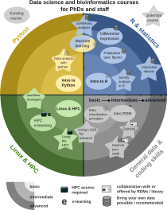

# 🌱 Data Science and Bioinformatics curriculum for UU PhDs and professionals

Welcome on my page about data science and bioinformatics education for PhDs and staff! 
Click [here](https://lauralwd.github.io/) to go back to my main page

I'm Laura, a plant-biologist-turned-bioinformatician with a passion for teaching. 
Below, you'll find a selection of courses I offer, each designed to be hands-on, engaging, and directly applicable to your research. 
Click on each course to learn more.

These courses are offered to PhDs of the Graduate School of Life Sciences (GS-LS) at Utrecht University (UU) via the [PhD Course Centre](https://www.uu.nl/en/education/graduate-school-of-life-sciences/phd-programmes/phd-course-centre). The teachers of these courses are myself, Laura Dijkhuizen, lecturer at the Theoretical Biology and Bioinformatics group (TBB) at UU, and Adrien Melquiond, assistant professor at the Center for Molecular Medicine at the University Medical Centre Utrecht (UMCU).

This infographic provides a structured overview of all courses currently taught and those that may be organised in the future.

## 📚 Courses I Teach

Click the course titles for more details on their contents and details for enrolment.

- **[Introduction to R for Life Sciences](/professional_education/courses/intro-r)** – Dive into the world of R programming and unlock the power of data analysis and visualisation.
- **[Publication Quality Figures with ggplot2 in R](/professional_education/courses/ggplot2-course)** – Transform your data into stunning visual stories using ggplot2.
- **[Differential Expression Analysis](/professional_education/courses/de-analysis)** – Master the art of RNA-seq data analysis and uncover the secrets within your datasets.
- **[Introduction to Python](/professional_education/courses/intro-python)** – Embark on a journey into Python programming, tailored for life sciences applications.
- **[Linux & HPC for Research](/professional_education/courses/linux-hpc)** – Get comfortable with the Linux command line and harness the power of high-performance computing.
- **[Machine Learning for Research](/professional_education/courses/ml-course)** – Step into the future with machine learning techniques applicable to your research.

### 🧭 Where to Start?

Not sure which course is right for you? Here's a quick guide:

- If you're **new to programming**, start with **Introduction to R** or **Introduction to Python**.
  - **R** is a data analysis and statistics language very popular in life sciences. The intro to R course is the most popular of all my courses.
  - **Python** is a more general purpose language that also does data analysis. Chose this if you expect to do cutting edge machine learning, or if you want to use programming skills in other fields than data analysis.   
- If you code R and want to improve your **data visualisation** take **ggplot2**.
- If you plan to work with **RNA-seq data**, build your R skills well in advance. Start with **intro to R** at least a year in advance, then do **gplot2**, keep practicing R in the mean time, and then do the **differential expression** course.
- If you expect to deal with data that needs Linux tools or the HPC, start with **Linux & HPC for Research** well in advance.
- If you're interested in **machine learning**, stay tuned for our upcoming **Machine Learning for Research** course! Make sure you have sufficient experience with R or Python.

## 🎓 Who Can Join?

- GS-LS PhD candidates have priority access and can join free of charge via the PCC.
- Postdocs, research staff or the life sciences faculties at UU may be admitted depending on availability. Contact the pcc office for more info.

## 🔮 Potential Future Courses

This is a list of courses that may, or may not be developed based on demand and resources available for course development.

- **Python for Data Analysis** – A follow-up to the Introduction to Python course, covering data manipulation, visualisation, and exploratory analysis with pandas, Matplotlib, and Seaborn.
- **Using the HPC Efficiently** – A hands-on course to complement the existing Linux & HPC course, focusing on job submission, workflow optimisation, and parallel computing.
- **Improve Your Code** – Covers best practices for writing clean, reusable, and well-documented code, with an emphasis on readability and sustainability.
- **Responsible & Effective Use of Large Language Models (LLMs) in Research** – Learn how to leverage ChatGPT and other LLMs effectively for research while considering privacy and ethical concerns.
- **Collaborative Coding with GitHub** – Practical training on version control, collaborative coding, and best practices for managing repositories.
- **Interactive Data Visualisation** – Training on dynamic and web-based visualisation tools to improve scientific communication.
- **Single-Cell RNA-seq Analysis** – A specialised course covering preprocessing, clustering, and interpretation of single-cell transcriptomics data.
- **Survey Data Analysis** – A course tailored for researchers working with survey data, focusing on structured data handling and statistical analysis.

## 🎓 Teaching Philosophy

- **Hands-on Learning** – I believe in learning by doing. My courses are interactive and practical, ensuring you can apply new skills immediately. Intro courses come with lots of exercises, advanced courses come with exercises too, but are the most fun with your own data!
- **Flexible & Modular** – Whether you're a novice or looking to deepen your expertise, there's a course for you. Especially advanced courses can be adapted to your personal goals.
- **Thorough understanding** – My courses give you a thorough basic understanding of basic and advanced tools. We take the time to develop skills that last and implement them in your day-to-day science as soon as possible.

If you have questions or want to discuss which course suits your needs, feel free to reach out!

📩 **Contact:** [l.w.dijkhuizen@uu.nl](mailto:l.w.dijkhuizen@uu.nl) | 🌐 **Website:** [lauradijkhuizen.com](https://lauralwd.github.io/)